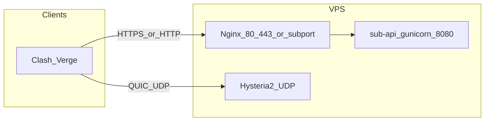

# 一键部署说明（deploy.sh）

面向 Debian/Ubuntu，**root** 执行：`sudo bash deploy.sh`

只部署 **Hysteria2**（QUIC/UDP）。域名模式走 **真实域名 + Let's Encrypt 证书**，客户端校验真证书，比裸 IP 更隐蔽安全。已移除 Xray/VLESS（TCP）。

## 架构总览

| 组件 | 作用 | 监听 |
|------|------|------|
| **Nginx** | 反代订阅 `/sub`、`/health` 到本机 gunicorn | 域名模式 80/443；IP 模式为所选 `sub_port` |
| **sub-api** | Flask 生成 Clash YAML | `127.0.0.1:8080` |
| **Hysteria2** | QUIC 代理，密码为用户 UUID；域名模式用 LE 证书，SNI=域名 | `hy2_port` UDP |

状态与数据目录：`/opt/vpn-stack/`（`state.json`、`tokens.json`、`params.json`、`sub-api/app.py`）。

## 安装流程（域名模式，脚本实际顺序）

1. 交互输入 **域名**、**Hysteria2 端口(UDP)**、证书方式（LE / 自签）。
2. `apt` 安装依赖（`nginx`、`certbot`、`ufw`、`python3` 等），下载 **Hysteria2** 二进制。
3. 先起 **Nginx(80)** → `certbot certonly --webroot` 申请证书（已有未到期证书则复用/续期）→ 补 **Nginx(443)**。
4. 写入 **Hysteria2** systemd + 配置（`/etc/ssl/vpn/cert.pem` 指向 LE `fullchain`，`skip-cert-verify=false`）。
5. 部署 **sub-api**（venv + gunicorn），`py_compile` 通过才继续。
6. 写入 **`state.json` / `params.json`**，**ufw 放行**（若已安装 ufw）。
7. **`_seed_first_user`**：写入首个用户到 `tokens.json`、`_rebuild_hy2_config`（HY2 用 string 伪装 `content: "OK"`）。
8. **启动** `hysteria2` / `sub-api` / `nginx`。
9. **`_connectivity_test`**：检查 systemd、`ss` UDP 监听、`/health`、`/sub` YAML。
10. 打印 **首个用户订阅 URL**：`https://<域名>/sub?token=<TOKEN>`。

纯 IP 模式类似，但用自签证书、HTTP 订阅（`http://<IP>:<sub_port>/sub?token=...`），`skip-cert-verify=true`。

## 云安全组（必做）

脚本无法修改云厂商控制台，**必须在安全组放行**：

- **Hysteria2**：与 `state.json` 中 `hy2_port` 一致的 **UDP** 入站。
- **域名模式订阅 / 证书**：**TCP 80/443**（证书 http-01 校验靠 80）。
- **IP 模式订阅**：`sub_port` 的 **TCP** 入站。

仅放行 TCP 不放行 UDP 会导致 **Hysteria2 一直 timeout**。

> **与其他面板共存**：若机器上已有 s-ui / sing-box 等占用 UDP 443，务必给 Hysteria2 选一个**不同的 UDP 端口**，避免 `bind: address already in use`。

## 常见问题

### Hysteria2 起不来：`bind: address already in use`

`hy2_port` 被别的服务（如 s-ui 的 UDP 443）占用。换一个 UDP 端口重装，或停掉占用方。

### 证书申请失败

`certbot --webroot` 需要 **80 端口从公网可达**（云安全组 + DNS 解析到本机）。失败会自动降级自签名（客户端需 `skip-cert-verify=true`）。

### 订阅 502

gunicorn 未监听 `127.0.0.1:8080`：`systemctl status sub-api`，`journalctl -u sub-api`。

### ufw 未 enable

脚本会 `ufw allow` 写入规则；`ufw` 未 enable 时本机默认不拦截，**云安全组仍须手动放行**。

## 卸载

菜单选项 **6** 或参考脚本中 `do_uninstall`（删除 `/opt/vpn-stack`、`/usr/local/bin/hysteria`，并清理旧的 `/usr/local/bin/xray`、`/etc/xray`）。
